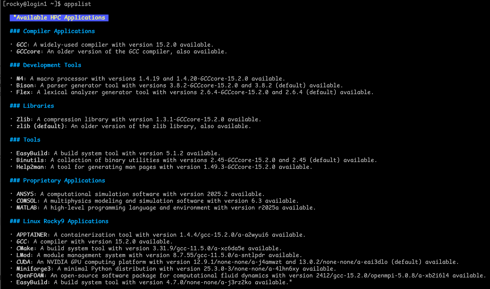

Creating a user-friendly output of available modules utilising a small, local AI server.



## AI Server

Use Ollama with the llama-3.2 model (~2GB footprint on storage + memory).

```bash
curl -fsSL https://ollama.com/install.sh | sh
ollama pull llama-3.2:latest
```

## Data Parsing

Run the following script routinely (e.g. nightly with Cron) to digest the applications list into a markdown file.

```bash
APPS_LIST="$(module avail 2>&1 |awk '{printf "%s\\n", $0}')"

OUTPUT=$(curl -sq -X POST http://localhost:11434/api/chat \
  -H "Content-Type: application/json" \
  -d "{
    \"model\": \"llama3.2\",
    \"messages\": [
      {
        \"role\": \"user\",
        \"content\": \"Please summarise the following HPC application list (from 'modules avail') in a user-friendly text layout, formatted in markdown. Each item in a list should be formatted as '**APPLICATION NAME**: DESCRIPTION (AVAILABLE VERSIONS)'. ONLY mention versions that are listed as available in the output, if multiple versions of the same application are available then display them as a single item. DO NOT hallucinate links. These apps are already available to the end-user so should be promoting what they can do with their HPC Environment: $APPS_LIST\"
      }
    ],
    \"stream\": false
}")

RESPONSE=$(echo "$OUTPUT" |jq '.message.content')
echo -e "$RESPONSE" > /tmp/apps_list.md
```


## Data Presentation

Install Glow (for fancy Markdown formatting)
```bash
echo '[charm]
name=Charm
baseurl=https://repo.charm.sh/yum/
enabled=1
gpgcheck=1
gpgkey=https://repo.charm.sh/yum/gpg.key' > /etc/yum.repos.d/charm.repo

dnf install glow
```

Save the following script to `/usr/sbin/appslist` and make executable
```bash
glow -w $(tput cols) /tmp/apps_list.md
```

